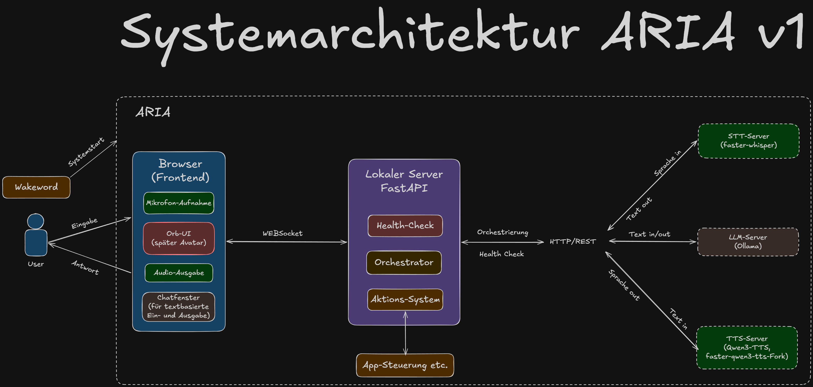

# ARIA

ARIA ist die Neuauflage eines älteren Projekts von mir. Die ursprüngliche Idee und der erste Ansatz sind bereits eine Weile her. Seitdem hat sich technisch und konzeptionell einiges verändert, weshalb ich das Projekt aktuell nicht einfach fortführe, sondern die Konzeption grundlegend überdenke.

> Hinweis: Dieses Repository befindet sich in aktiver Entwicklung. Dokumentation und README werden fortlaufend erweitert und aktualisiert. Es kann vorkommen, dass einzelne Komponenten bereits umgesetzt, aber noch nicht vollständig dokumentiert sind oder auf GitHub gepusht wurden. Ich bemühe mich, den Stand zeitnah nachzuziehen.

## 🎯 Ziel

Ein lokal laufender KI-Companion mit Sprachein- und -ausgabe, komplett auf eigener Hardware, ohne Cloud-Dienste.

**Ziel für Version 1:** Ein durchgehendes Gespräch per Stimme führen können, mit einfacher visueller Rückmeldung über eine Orb-UI, dazu ein paar grundlegende Aktionen (Anwendungen starten, Musik abspielen, Informationen nachschlagen).

## 🏗️ Architektur

Python/FastAPI orchestriert drei isolierte lokale Dienste in eigenen Docker-Containern: Spracherkennung (faster-whisper), Sprachmodell (Ollama) und Sprachausgabe (Qwen3-TTS). Das Frontend läuft als Web-Stack (Three.js) im Browser. Gestartet wird ARIA per Doppelklick auf ein Startskript oder per Wakeword (erkannt von einem eigenständigen Hintergrundskript). ARIA befindet sich nach dem Start standardmäßig im Sprachmodus und hört kontinuierlich zu. Wahlweise lässt sie sich per Chat-Button auf Texteingabe umschalten.

## 📁 Repo-Struktur

_wird ergänzt, sobald das Projekt-Grundgerüst steht_

## 🗺️ Roadmap Version 1

- [ ] Projekt-Grundgerüst (Repo-Struktur, Environment, GPU-Check)
- [ ] LLM-Dienst (Ollama)
- [ ] Spracherkennung (faster-whisper)
- [ ] Sprachausgabe (Qwen3-TTS)
- [ ] Zusammenspiel aller Dienste über Docker Compose
- [ ] Orchestrator (FastAPI)
- [ ] Web-Frontend mit Orb-UI
- [ ] Wakeword-Erkennung (Doppelklatschen)
- [ ] Start-Workflow
- [ ] Grundlegende Aktionen (Anwendungen starten, Musik abspielen, Suche)
- [ ] Gedächtnis über Sitzungen hinweg
- [ ] Fehlerbehandlung
- [ ] Gesamttest -> Version 1

## 📊 Status

| Phase | Komponente | Status | Datum | Doku |
|---|---|---|---|---|
| 0 | Konzeption (Architektur & Planung) | ✅ Abgeschlossen | 20-08-2026 | - |
| 1 | Umsetzung Version 1 | ⏳ In Bearbeitung | - | - |

## 📬 Kontakt
Bei Fragen, Anregungen, Tipps oder Anmerkungen erreichst du mich gerne über [LinkedIn](https://www.linkedin.com/in/stefan-höger-5a375a339/) oder [XING](https://www.xing.com/profile/Stefan_Hoeger049861/web_profiles?nwt_nav=profile).

Über Rückmeldungen und Austausch freue ich mich immer.
